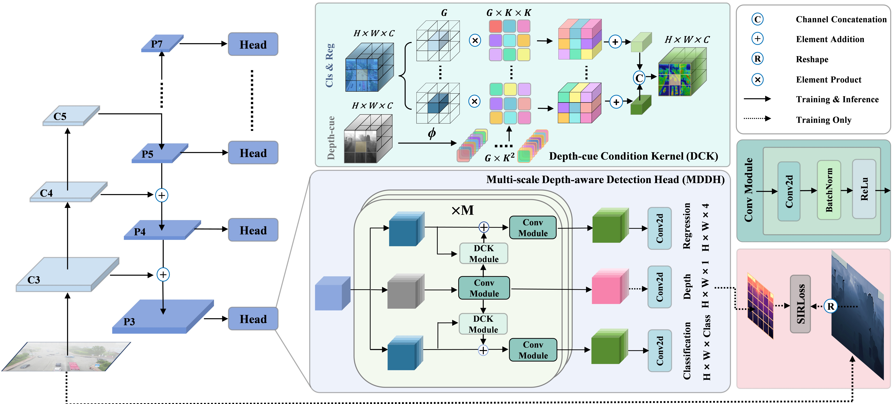

# HazyDet: Open-Source Benchmark for Drone-View Object Detection With Depth-Cues in Hazy Scenes
This repository is the official implementation of HazyDet

- [HazyDet](#hazydet)
- [Leadboard and Model Zoo](#leadboard-and-model-zoo)
  - [Detectors](#detectors)
  - [Dehazing](#dehazing)
- [DeCoDet](#decodet)
  - [Installation](#installation)
    - [Step 1: Create a conda](#step-1-create-a-conda)
    - [Step 2: Install PyTorch](#step-2-install-pytorch)
    - [Step 3: Install OpenMMLab 2.x Codebases](#step-3-install-openmmlab-2x-codebases)
    - [Step 4: Install `HazyDet`](#step-4-install-hazydet)
  - [Training](#training)
  - [Inference](#inference)
  - [Depth Maps](#depth-maps)
- [Acknowledgement](#acknowledgement)
- [Citation](#citation)

## HazyDet


You can **download** our HazyDet dataset from [**Baidu Netdisk**](https://pan.baidu.com/s/1KKWqTbG1oBAdlIZrTzTceQ?pwd=grok) or [**OneDrive**](https://1drv.ms/f/s!AmElF7K4aY9p83CqLdm4N-JSo9rg?e=H06ghJ).<br>

For both training and inference, the following dataset structure is required:

```
HazyDet
|-- train
    |-- clean images
    |-- hazy images
    |-- labels
|-- val
    |-- clean images
    |-- hazy images
    |-- labels
|-- test
    |-- clean images
    |-- hazy images
    |-- labels
|-- RDDTS
    |-- hazy images
    |-- labels
```

**Note: Both passwords for BaiduYun and OneDrive is `grok`**.


## Leadboard and Model Zoo

All the weight files in the model zoo can be accessed on [Baidu Cloud](https://pan.baidu.com/s/1EEX_934Q421RkHCx53akJQ?pwd=grok) and [OneDrive](https:).

### Detectors


<table>
    <tr>
        <td>Model</td>
        <td>Backbone</td> 
        <td>#Params (M)</td>
        <td>GFLOPs</td>
        <td>mAP on<br>Test-set</td> <!-- 使用 <br> 标签换行 -->
        <td>mAP on<br>RDDTS</td>
        <td>Config</td>
        <td>Weight</td>        
    </tr>
    <tr>
        <td>One Stage</td>
        <td></td> 
        <td></td>
        <td></td>
        <td></td>
        <td></td>
        <td></td>
        <td></td>
    </tr>
    <tr>
        <td>YOLOv3</td>
        <td>Darknet53</td>
        <td>61.63</td>
        <td>20.19</td>
        <td>35.0</td>
        <td>19.2</td>
        <td><a href="./configs/Benchmark/yolov3/yolov3_d53_8xb8-ms-416-273e_hazydet.py">config</a></td>
        <td><a href="https://pan.baidu.com/s/1EEX_934Q421RkHCx53akJQ?pwd=grok">weight</a></td>
    </tr>
    <tr>
        <td>GFL</td>
        <td>ResNet50</td> 
        <td>32.26</td>
        <td>198.65</td>
        <td>36.8</td>
        <td>13.9</td>
        <td><a href="./configs/Benchmark/gfl/gfl_r50_fpn_1x_hazydet.py">config</a></td> <!-- 新增链接 -->
        <td><a href="https://pan.baidu.com/s/1EEX_934Q421RkHCx53akJQ?pwd=grok">weight</a></td>
    </tr>
    <tr>
        <td>YOLOX</td>
        <td>CSPDarkNet</td> 
        <td>8.94</td>
        <td>13.32</td>
        <td>42.3</td>
        <td>24.7</td>
        <td><a href="./configs/Benchmark/yolox/yolox_s_8xb8-300e_hazydet.py">config</a></td> <!-- 新增链接 -->
        <td><a href="https://pan.baidu.com/s/1EEX_934Q421RkHCx53akJQ?pwd=grok">weight</a></td>
    </tr>
    <tr>
        <td>RepPoints</td>
        <td>ResNet50</td> 
        <td>36.83</td>
        <td>184.32</td>
        <td>43.8</td>
        <td>21.3</td>
        <td><a href="./configs/Benchmark/reppoints/reppoints-moment_r50_fpn-gn_head-gn_1x_hazydet.py">config</a></td> <!-- 新增链接 -->
        <td><a href="https://pan.baidu.com/s/1EEX_934Q421RkHCx53akJQ?pwd=grok">weight</a></td>
    </tr>
    <tr>
        <td>FCOS</td>
        <td>ResNet50</td> 
        <td>32.11</td>
        <td>191.48</td>
        <td>45.9</td>
        <td>22.8</td>
        <td><a href="./configs/Benchmark/fcos/fcos_r50_1x_hazydet.py">config</a></td> <!-- 新增链接 -->
        <td><a href="https://pan.baidu.com/s/1EEX_934Q421RkHCx53akJQ?pwd=grok">weight</a></td>
    </tr>
    <tr>
        <td>Centernet</td>
        <td>ResNet50</td> 
        <td>32.11</td>
        <td>191.49</td>
        <td>47.2</td>
        <td>23.8</td>
        <td><a href="./configs/Benchmark/centernet/centernet-update_r50-caffe_fpn_ms-1x_hazydet.py">config</a></td> <!-- 新增链接 -->
        <td><a href="https://pan.baidu.com/s/1EEX_934Q421RkHCx53akJQ?pwd=grok">weight</a></td>
    </tr>
    <tr>
        <td>ATTS</td>
        <td>ResNet50</td> 
        <td>32.12</td>
        <td>195.58</td>
        <td>50.4</td>
        <td>25.1</td>
        <td><a href="./configs/Benchmark/atts/atss_r50_fpn_1x_hazydet.py">config</a></td> <!-- 新增链接 -->
        <td><a href="https://pan.baidu.com/s/1EEX_934Q421RkHCx53akJQ?pwd=grok">weight</a></td>
    </tr>
    <tr>
        <td>DDOD</td>
        <td>ResNet50</td> 
        <td>32.20</td>
        <td>173.05</td>
        <td>50.7</td>
        <td>26.1</td>
        <td><a href="./configs/Benchmark/ddod/ddod_r50_fpn_1x_hazydet.py">config</a></td> <!-- 新增链接 -->
        <td><a href="https://pan.baidu.com/s/1EEX_934Q421RkHCx53akJQ?pwd=grok">weight</a></td>
    </tr>
    <tr>
        <td>VFNet</td>
        <td>ResNet50</td> 
        <td>32.89</td>
        <td>187.39</td>
        <td>51.1</td>
        <td>25.6</td>
        <td><a href="./configs/Benchmark/vfnet/vfnet_r50_fpn_1x_hazydet.py">config</a></td> <!-- 新增链接 -->
        <td><a href="https://pan.baidu.com/s/1EEX_934Q421RkHCx53akJQ?pwd=grok">weight</a></td>
    </tr>
    <tr>
        <td>TOOD</td>
        <td>ResNet50</td> 
        <td>32.02</td>
        <td>192.51</td>
        <td>51.4</td>
        <td>25.8</td>
        <td><a href="./configs/Benchmark/tood/tood_r50_fpn_1x_hazydet.py">config</a></td> <!-- 新增链接 -->
        <td><a href="https://pan.baidu.com/s/1EEX_934Q421RkHCx53akJQ?pwd=grok">weight</a></td>
    </tr>
    <tr>
        <td>Two Stage</td>
        <td></td> 
        <td></td>
        <td></td>
        <td></td>
        <td></td>
        <td></td>
        <td></td>
    </tr>
    <tr>
        <td>Sparse RCNN</td>
        <td>ResNet50</td> 
        <td>108.54</td>
        <td>147.45</td>
        <td>27.7</td>
        <td>10.4</td>
        <td><a href="./configs/Benchmark/sparse_rcnn/sparse-rcnn_r50_fpn_1x_hazydet.py">config</a></td> <!-- 新增链接 -->
        <td><a href="https://pan.baidu.com/s/1EEX_934Q421RkHCx53akJQ?pwd=grok">weight</a></td>
    </tr>
    <tr>
        <td>Dynamic RCNN</td>
        <td>ResNet50</td> 
        <td>41.35</td>
        <td>201.72</td>
        <td>47.6</td>
        <td>22.5</td>
        <td><a href="./configs/Benchmark/dynamic_rcnn/dynamic-rcnn_r50_fpn_1x_hazydet.py">config</a></td> <!-- 新增链接 -->
        <td><a href="https://pan.baidu.com/s/1EEX_934Q421RkHCx53akJQ?pwd=grok">weight</a></td>
    </tr>
    <tr>
        <td>Faster RCNN</td>
        <td>ResNet50</td> 
        <td>41.35</td>
        <td>201.72</td>
        <td>48.7</td>
        <td>23.6</td>
        <td><a href="./configs/Benchmark/faster_rcnn/faster-rcnn_r50_fpn_1x_hazydet.py">config</a></td> <!-- 新增链接 -->
        <td><a href="https://pan.baidu.com/s/1EEX_934Q421RkHCx53akJQ?pwd=grok">weight</a></td>
    </tr>
    <tr>
        <td>Libra RCNN</td>
        <td>ResNet50</td> 
        <td>41.62</td>
        <td>209.92</td>
        <td>49.0</td>
        <td>23.7</td>
        <td><a href="./configs/Benchmark/libra_rcnn/libra-faster-rcnn_r50_fpn_1x_hazydet.py">config</a></td> <!-- 新增链接 -->
        <td><a href="https://pan.baidu.com/s/1EEX_934Q421RkHCx53akJQ?pwd=grok">weight</a></td>
    </tr>
    <tr>
        <td>Grid RCNN</td>
        <td>ResNet50</td> 
        <td>64.46</td>
        <td>317.44</td>
        <td>50.5</td>
        <td>25.2</td>
        <td><a href="./configs/Benchmark/grid_rcnn/grid-rcnn_r50_fpn_gn-head_1x_hazydet.py">config</a></td> <!-- 新增链接 -->
        <td><a href="https://pan.baidu.com/s/1EEX_934Q421RkHCx53akJQ?pwd=grok">weight</a></td>
    </tr>
    <tr>
        <td>Cascade RCNN</td>
        <td>ResNet50</td> 
        <td>69.15</td>
        <td>230.40</td>
        <td>51.6</td>
        <td>26.0</td>
        <td><a href="./configs/Benchmark/cascade_rcnn/cascade-rcnn_r50_fpn_1x_hazydet.py">config</a></td> <!-- 新增链接 -->
        <td><a href="https://pan.baidu.com/s/1EEX_934Q421RkHCx53akJQ?pwd=grok">weight</a></td>
    </tr>
    <tr>
        <td>End-to-End</td>
        <td></td> 
        <td></td>
        <td></td>
        <td></td>
        <td></td>
        <td></td>
        <td></td>
    </tr>
    <tr>
        <td>Conditional DETR</td>
        <td>ResNet50</td> 
        <td>43.55</td>
        <td>94.17</td>
        <td>30.5</td>
        <td>11.7</td>
        <td><a href="./configs/Benchmark/conditional_detr/conditional-detr_r50_8xb2-50e_hazydet.py">config</a></td> <!-- 新增链接 -->
        <td><a href="https://pan.baidu.com/s/1EEX_934Q421RkHCx53akJQ?pwd=grok">weight</a></td>
    </tr>
    <tr>
        <td>DAB DETR</td>
        <td>ResNet50</td> 
        <td>43.70</td>
        <td>97.02</td>
        <td>31.3</td>
        <td>11.7</td>
        <td><a href="./configs/Benchmark/dab_detr/dab-detr_r50_8xb2-50e_hazydet.py">config</a></td> <!-- 新增链接 -->
        <td><a href="https://pan.baidu.com/s/1EEX_934Q421RkHCx53akJQ?pwd=grok">weight</a></td>
    </tr>
    <tr>
        <td>Deform DETR</td>
        <td>ResNet50</td> 
        <td>40.01</td>
        <td>192.51</td>
        <td>51.9</td>
        <td>26.5</td>
        <td><a href="./configs/Benchmark/deform_detr/deformable-detr_r50_16xb2-50e_hazydet.py">config</a></td> <!-- 新增链接 -->
        <td><a href="https://pan.baidu.com/s/1EEX_934Q421RkHCx53akJQ?pwd=grok">weight</a></td>
    </tr>
    <tr>
        <td>Plug-and-Play</td>
        <td></td> 
        <td></td>
        <td></td>
        <td></td>
        <td></td>
        <td></td>
        <td></td>
    </tr>
    <tr>
        <td>FCOS-DeCoDet</td>
        <td>ResNet50</td> 
        <td>34.62</td>
        <td>225.37</td>
        <td>47.4</td>
        <td>24.3</td>
        <td><a href="./configs/DeCoDet/DeCoDet_r50_1x_hazydet.py">config</a></td> <!-- 新增链接 -->
        <td><a href="https://pan.baidu.com/s/1EEX_934Q421RkHCx53akJQ?pwd=grok">weight</a></td>
    </tr>
    <tr>
        <td>VFNet-DeCoDet</td>
        <td>ResNet50</td> 
        <td>34.61</td>
        <td>249.91</td>
        <td>51.5</td>
        <td>25.9</td>
        <td><a href="./configs/DeCoDet/DeCoDet_r50_1x_hazydet.py">config</a></td> <!-- 新增链接 -->
        <td><a href="https://pan.baidu.com/s/1EEX_934Q421RkHCx53akJQ?pwd=grok">weight</a></td>
    </tr>
</table>


### Dehazing

<table>
    <tr>
        <td>Type</td>
        <td>Method</td>
        <td>PSNR</td>
        <td>SSIM</td>
        <td>mAP on Test-set</td>
        <td></td>
        <td>mAP on RDDTS</td>
        <td>Weight</td>
    </tr>
    <tr>
        <td>Baseline</td>
        <td>Faster RCNN</td>
        <td>-</td>
        <td>-</td>
        <td>39.5</td>
        <td></td>
        <td>21.5</td>
        <td><a href="https://pan.baidu.com/s/1EEX_934Q421RkHCx53akJQ?pwd=grok">weight</a></td>
    </tr>
    <tr>
        <td>Dehaze</td>
        <td>GridDehaze</td>
        <td>12.66</td>
        <td>0.713</td>
        <td>38.9 (-0.6)</td>
        <td></td>
        <td>19.6 (-1.9)</td>
        <td><a href="https://pan.baidu.com/s/1EEX_934Q421RkHCx53akJQ?pwd=grok">weight</a></td>
    </tr>
    <tr>
        <td>Dehaze</td>
        <td>MixDehazeNet</td>
        <td>15.52</td>
        <td>0.743</td>
        <td>39.9 (+0.4)</td>
        <td></td>
        <td>21.2 (-0.3)</td>
        <td><a href="https://pan.baidu.com/s/1EEX_934Q421RkHCx53akJQ?pwd=grok">weight</a></td>
    </tr>
    <tr>
        <td>Dehaze</td>
        <td>DSANet</td>
        <td>19.01</td>
        <td>0.751</td>
        <td>40.8 (+1.3)</td>
        <td></td>
        <td>22.4 (+0.9)</td>
        <td><a href="https://pan.baidu.com/s/1EEX_934Q421RkHCx53akJQ?pwd=grok">weight</a></td>
    </tr>
    <tr>
        <td>Dehaze</td>
        <td>FFA</td>
        <td>19.25</td>
        <td>0.798</td>
        <td>41.2 (+1.7)</td>
        <td></td>
        <td>22.0 (+0.5)</td>
        <td><a href="https://pan.baidu.com/s/1EEX_934Q421RkHCx53akJQ?pwd=grok">weight</a></td>
    </tr>
    <tr>
        <td>Dehaze</td>
        <td>DehazeFormer</td>
        <td>17.53</td>
        <td>0.802</td>
        <td>42.5 (+3.0)</td>
        <td></td>
        <td>21.9 (+0.4)</td>
        <td><a href="https://pan.baidu.com/s/1EEX_934Q421RkHCx53akJQ?pwd=grok">weight</a></td>
    </tr>
    <tr>
        <td>Dehaze</td>
        <td>gUNet</td>
        <td>19.49</td>
        <td>0.822</td>
        <td>42.7 (+3.2)</td>
        <td></td>
        <td>22.2 (+0.7)</td>
        <td><a href="https://pan.baidu.com/s/1EEX_934Q421RkHCx53akJQ?pwd=grok">weight</a></td>
    </tr>
    <tr>
        <td>Dehaze</td>
        <td>C2PNet</td>
        <td>21.31</td>
        <td>0.832</td>
        <td>42.9 (+3.4)</td>
        <td></td>
        <td>22.4 (+0.9)</td>
        <td><a href="https://pan.baidu.com/s/1EEX_934Q421RkHCx53akJQ?pwd=grok">weight</a></td>
    </tr>
    <tr>
        <td>Dehaze</td>
        <td>DCP</td>
        <td>16.98</td>
        <td>0.824</td>
        <td>44.0 (+4.5)</td>
        <td></td>
        <td>20.6 (-0.9)</td>
        <td><a href="https://pan.baidu.com/s/1EEX_934Q421RkHCx53akJQ?pwd=grok">weight</a></td>
    </tr>
    <tr>
        <td>Dehaze</td>
        <td>RIDCP</td>
        <td>16.15</td>
        <td>0.718</td>
        <td>44.8 (+5.3)</td>
        <td></td>
        <td>24.2 (+2.7)</td>
        <td><a href="https://pan.baidu.com/s/1EEX_934Q421RkHCx53akJQ?pwd=grok">weight</a></td>
    </tr>
</table>


## DeCoDet


### Installation

#### Step 1: Create a conda 

```shell
$ conda create --name HazyDet python=3.9
$ source activate HazyDet
```

#### Step 2: Install PyTorch

```shell
conda install pytorch torchvision torchaudio pytorch-cuda=12.1 -c pytorch -c nvidia
```

#### Step 3: Install OpenMMLab 2.x Codebases

```shell
# openmmlab codebases
pip install -U openmim --no-input
mim install mmengine "mmcv>=2.0.0" "mmdet>=3.0.0" "mmsegmentation>=1.0.0" "mmrotate>=1.0.0rc1" mmyolo "mmpretrain>=1.0.0rc7" 'mmagic'
# other dependencies
pip install -U ninja scikit-image --no-input
```

#### Step 4: Install `HazyDet`

```shell
python setup.py develop
```

**Note**: make sure you have `cd` to the root directory of `HazyDet`

```shell
$ git clone git@github.com:GrokCV/HazyDet.git
$ cd HazyDet
```

### Training
```shell
 $ python tools/train_det.py configs/DeCoDet/DeCoDet_r50_1x_hazydet.py
```         


### Inference
```shell
$ python tools/test.py configs/DeCoDet/DeCoDet_r50_1x_hazydet365k.py weights/fcos_DeCoDet_r50_1x_hazydet.pth
```

We released our [checkpoint](https://pan.baidu.com/s/1EEX_934Q421RkHCx53akJQ?pwd=grok) on HazyDet <br>

### Depth Maps

The depth map required for training can be obtained through [Metic3D](https://github.com/YvanYin/Metric3D). They can also be acquired through other depth estimation models.<br>
## Acknowledgement
We are grateful to the Tianjin Key Laboratory of Visual Computing and Intelligent Perception (VCIP) for providing essential resources. Our sincere appreciation goes to Professor Pengfei Zhu and the dedicated AISKYEYE team at Tianjin University for their invaluable support with data, which has been crucial to our research efforts. We also deeply thank Xianghui Li, Yuxin Feng, and other researchers for granting us access to their datasets, significantly advancing and promoting our work in this field. Additionally, our thanks extend to [Metric3D](https://github.com/YvanYin/Metric3D) for its contributions to the methodology presented in this article. 


## Citation

If you use this toolbox or benchmark in your research, please cite this project.

```bibtex
@article{feng2024HazyDet,
	title={HazyDet: Open-source Benchmark for Drone-view Object Detection with Depth-cues in Hazy Scenes}, 
	author={Feng, Changfeng and Chen, Zhenyuan and Kou, Renke and Gao, Guangwei and Wang, Chunping and Li, Xiang and Shu, Xiangbo and Dai, Yimian and Fu, Qiang and Yang, Jian},
	year={2024},
	journal={arXiv},
}

@article{zhu2021detection,
  title={Detection and tracking meet drones challenge},
  author={Zhu, Pengfei and Wen, Longyin and Du, Dawei and Bian, Xiao and Fan, Heng and Hu, Qinghua and Ling, Haibin},
  journal={IEEE Transactions on Pattern Analysis and Machine Intelligence},
  volume={44},
  number={11},
  pages={7380--7399},
  year={2021},
  publisher={IEEE}
}
```